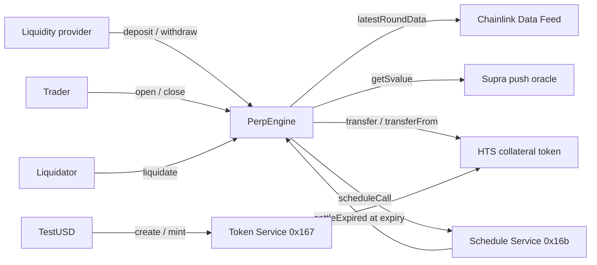

# Tinyperp

A [Scaffold-HBAR](https://docs.hedera.com/solutions/tools/scaffold-hbar) template for leveraged long and short positions on Hedera. Prices come from Chainlink Data Feeds and are cross-checked against Supra. Collateral is a Hedera Token Service token. Positions settle themselves through the Hedera Schedule Service, with no keeper bot.

```bash
npm create scaffold-hbar@latest my-perps -- --template DeborahOlaboye/tinyperp
```

Tinyperp is a starting point for derivatives on Hedera: perpetual-style trading, structured products, hedging tools, or any app where a user takes a priced position against a pool. It is small enough to read in one sitting (one engine contract of about 500 lines) and complete enough to run: liquidity pool, fees, liquidations, expiry, oracle safety and a testnet faucet.

> Tinyperp is template code. It has not been audited. Read [Limits and risks](#limits-and-risks) before putting value behind it.

## Contents

- [What you get](#what-you-get)
- [Why these integrations](#why-these-integrations)
- [Quick start](#quick-start)
- [How it works](#how-it-works)
- [A worked example](#a-worked-example)
- [Oracles](#oracles)
- [Hedera services](#hedera-services)
- [Hedera details that will bite you](#hedera-details-that-will-bite-you)
- [Contract reference](#contract-reference)
- [Configuration](#configuration)
- [Deploy to Hedera testnet](#deploy-to-hedera-testnet)
- [Testing](#testing)
- [Project layout](#project-layout)
- [Commands](#commands)
- [Extending the template](#extending-the-template)
- [Limits and risks](#limits-and-risks)
- [Troubleshooting](#troubleshooting)
- [Licence](#licence)

## What you get

| Piece | What it does |
| --- | --- |
| `PerpEngine` | Opens, closes, liquidates and expires leveraged positions against one liquidity pool. |
| `OracleLib` | Reads Chainlink and Supra, normalises both to 18 decimals, checks freshness and agreement. |
| `TestUSD` | Creates the HTS collateral token on testnet and runs a faucet for it. |
| Mocks | Chainlink feed, Supra feed, HTS-like token and Schedule Service, for local chains and tests. |
| Deploy scripts | One command deploys everything, lists three markets and seeds the pool. |
| Smoke test | One command runs the full flow on a live network and prints a HashScan link per step. |
| Tests | 39 tests: engine logic, the HTS system contract, and the live Chainlink and Supra contracts. |
| Frontend | The Scaffold-HBAR Next.js app: wallet connection and a Debug Contracts page generated from the ABIs. |

Markets listed by default on testnet: HBAR/USD, BTC/USD and ETH/USD, each up to 10x.

## Why these integrations

**Chainlink Data Feeds are the engine's only source of truth.** Every entry price, exit price, liquidation and expiry settlement reads a Chainlink feed. Remove the feed and there is no product: a position cannot be priced, so it cannot open or close.

**Supra is a circuit breaker.** A push oracle can lag or, in the worst case, report a bad value. For any market that opts in, the engine compares Chainlink against the Supra push oracle. While the two disagree by more than a set tolerance, the market stops: no opens, closes or liquidations at a price nobody can vouch for.

**Push oracles are what make keeperless settlement possible.** Because the price is already on chain, a settlement call needs no off-chain data. That lets the Hedera Schedule Service call `settleExpired` at the end of a position's term with nothing but the position id. A pull oracle would need someone to fetch and attach a signed price, which is a keeper by another name.

## Quick start

### Prerequisites

- Node.js 20.18.3 or later
- Git, with `user.name` and `user.email` set
- Yarn (`corepack enable`)

### Scaffold and run locally

```bash
npm create scaffold-hbar@latest my-perps -- --template DeborahOlaboye/tinyperp
cd my-perps
```

Then, in three terminals:

```bash
# 1. A local chain that forks Hedera testnet and emulates the Token Service
yarn hardhat:chain

# 2. Deploy TestUSD, the engine, three mock-priced markets, and seed the pool
yarn hardhat:deploy --network localhost

# 3. The frontend, at http://localhost:3000
yarn next:dev
```

Run the tests:

```bash
yarn hardhat:test
```

Move a price on the local chain to see positions gain and lose:

```bash
yarn hardhat:set-price --market HBAR/USD --price 0.12
```

To run against real Chainlink and Supra prices, follow [Deploy to Hedera testnet](#deploy-to-hedera-testnet).

## How it works



### The pool

Liquidity providers deposit the collateral token and receive shares. The pool is the counterparty to every trade: when traders lose, the pool gains, and when traders win, the pool pays.

- The first deposit mints shares one to one. Later deposits mint at the current share price, `assets * totalShares / poolAssets`.
- Open fees are added to the pool, so the share price rises as the engine is used.
- Withdrawals can only take liquidity that is not reserved by open positions.

Shares are tracked inside the engine. They are not a transferable token.

### Opening a position

A trader chooses a market, a direction, a collateral amount, a whole-number leverage and a term.

1. The engine reads the oracle price and moves it against the trader by the spread. A long enters above the oracle price, a short below it.
2. The open fee, charged on notional, moves from the trader's collateral to the pool. What is left is the **margin**.
3. Notional **size** is `margin * leverage`.
4. The engine reserves `margin * maxProfitMultiple` of free pool liquidity for this position. If the pool cannot reserve it, the position does not open.

Step 4 is why the pool can always pay. A position's profit is capped at what was reserved for it when it opened, so the sum of everything the pool might owe is always held in the pool.

### Closing

The owner can close at any time. The engine reads the oracle price, moves it against the trader by the spread again, and pays:

```
pnl     = size * (exitPrice - entryPrice) / entryPrice      (negated for shorts)
payout  = clamp(margin + pnl, 0, margin + reserved)
```

Losses are capped at the margin. Profit is capped at the reservation.

### Liquidation

A position is liquidatable once its payout is at or below `liquidationThresholdBps` of its margin (10% by default). Anyone can call `liquidate`. The caller receives `liquidatorRewardBps` of the margin (5% by default), the trader receives whatever payout remains after the reward, and the rest of the margin goes to the pool.

### Expiry instead of funding

Perpetual exchanges use a funding rate to stop one side from holding pool liquidity for free. Tinyperp uses a term instead: every position has an expiry between `minDuration` and `maxDuration`. After expiry anyone can call `settleExpired`, which pays out exactly as a close would. This keeps the engine small and makes its behaviour easy to reason about. [Extending the template](#extending-the-template) describes how to add funding.

### Keeperless settlement

When opening, a trader can set `autoSettle` and send `config.autoSettleFee` in HBAR. The engine then asks the Hedera Schedule Service to call `settleExpired(positionId)` at the expiry second. The network executes that call itself. No bot, no cron job, no server.

- The fee prepays the gas of the scheduled call. The engine is the payer of the schedule, so it holds the fee until then.
- If the trader closes early or is liquidated, the engine deletes the schedule and refunds the fee.
- If the Schedule Service cannot book the call, the position still opens, the fee is returned, and `AutoSettleSkipped` is emitted. Anyone can settle it by hand after expiry.

Scheduling is best effort by design. Trading never depends on it.

### Payouts that cannot be delivered

On Hedera an account must be associated with a token to receive it. If the engine insisted on delivering every payout, a trader could dissociate from the collateral token and make their own position impossible to liquidate. Instead, a transfer that fails is credited to `claimable[account]` and can be collected later with `claim()`. Settlement always completes.

## A worked example

Default parameters: 0.10% open fee, 0.10% spread, 4x profit cap, 10% liquidation threshold, 5% liquidator reward.

A trader opens a **5x long on HBAR/USD with 100 tUSD** while Chainlink reports 0.1000.

| Step | Calculation | Result |
| --- | --- | --- |
| Open fee | 100 × 5 × 0.10% | 0.50 tUSD to the pool |
| Margin | 100 − 0.50 | 99.50 tUSD |
| Size | 99.50 × 5 | 497.50 tUSD |
| Reserved from pool | 99.50 × 4 | 398.00 tUSD |
| Entry price | 0.1000 × 1.001 | 0.1001 |

HBAR rises to 0.1100 and the trader closes.

| Step | Calculation | Result |
| --- | --- | --- |
| Exit price | 0.1100 × 0.999 | 0.10989 |
| PnL | 497.50 × (0.10989 − 0.1001) / 0.1001 | +48.66 tUSD |
| Payout | 99.50 + 48.66 | 148.16 tUSD |

The other outcomes for the same position:

| Oracle price at settlement | What happens |
| --- | --- |
| 0.1804 or higher | Payout hits the cap of 497.50 tUSD (margin plus reservation). |
| 0.0821 or lower | Payout is at or below 9.95 tUSD, so anyone can liquidate. The liquidator earns 4.975 tUSD. |
| 0.0801 or lower | The margin is gone. The trader receives nothing and the pool keeps the margin less the reward. |

## Oracles

### Chainlink Data Feeds

Each market stores a Chainlink feed address. `OracleLib.readChainlink` calls `latestRoundData()` and:

- reverts with `InvalidOraclePrice` if the answer is zero or negative,
- reverts with `StaleOraclePrice` if the round is older than the market's `maxPriceAge`,
- scales the answer from the feed's decimals to 18.

Feeds used on Hedera testnet:

| Market | Feed address |
| --- | --- |
| HBAR/USD | `0x59bC155EB6c6C415fE43255aF66EcF0523c92B4a` |
| BTC/USD | `0x058fE79CB5775d4b167920Ca6036B824805A9ABd` |
| ETH/USD | `0xb9d461e0b962aF219866aDfA7DD19C52bB9871b9` |

Mainnet addresses are in the [Chainlink documentation](https://docs.chain.link/data-feeds/price-feeds/addresses?network=hedera).

### Supra cross-check

A market listed with `crossCheck = true` is also compared against a Supra pair. `OracleLib.readSupra` calls `getSvalue(pairIndex)` on the Supra push oracle. The rule:

| Supra state | Effect |
| --- | --- |
| Fresh, and within `maxDeviationBps` of Chainlink | The Chainlink price is used. |
| Fresh, and further than `maxDeviationBps` from Chainlink | The call reverts with `OracleDeviationTooHigh`. The market is halted until the feeds agree. |
| Older than `supraMaxAge`, zero, or the call fails | Supra is ignored and the Chainlink price is used. |

Chainlink is the source of truth. Supra can stop a trade but never sets a price. A stale Supra value is ignored rather than trusted, because a secondary oracle that is not updating should not be able to freeze the market.

On Hedera testnet the Supra push oracle is at `0x6Cd59830AAD978446e6cc7f6cc173aF7656Fb917`. HBAR/USDT is pair index 75. Pair indexes are listed in the [Supra documentation](https://docs.supra.com/oracles/data-feeds/data-feeds-index).

### Testnet feeds are slow

On testnet, Chainlink feeds update on a heartbeat of about 24 hours, far slower than on mainnet, and Supra keeps only some pairs current. The testnet configuration therefore uses a `maxPriceAge` of 25 hours and cross-checks only HBAR/USD. Do not copy those numbers to mainnet. Set `maxPriceAge` to each feed's published heartbeat plus a small margin.

## Hedera services

| Service | How Tinyperp uses it |
| --- | --- |
| **Token Service (HTS)** | `TestUSD` creates the collateral token through the system contract at `0x167`, is its treasury and holds its supply key, so the faucet mints from Solidity with no off-chain signer. The engine associates itself with the token (HIP-719) and moves it through the token's ERC-20 facade. |
| **Schedule Service (HSS)** | The engine books `settleExpired` through the system contract at `0x16b` (HIP-1215), deletes the schedule on early close, and pays for execution from the trader's prepaid fee. |
| **Smart Contract Service** | The engine, oracle library and faucet are Solidity contracts on the Hedera EVM. |
| **Mirror node** | Every state change emits an event, so the full history of a position can be read from the mirror node or HashScan. |

## Hedera details that will bite you

These are the differences from other EVM chains that this template had to handle. Each one is encoded in the code so you do not have to rediscover it.

**HBAR has 8 decimals inside the EVM and 18 over JSON-RPC.** Inside a contract, `msg.value` and `address.balance` are in tinybars (1 HBAR = 100,000,000). Over JSON-RPC, `value` is in weibars (1 HBAR = 10^18) and the relay converts. `config.autoSettleFee` is in tinybars because the contract compares it to `msg.value`. When sending the transaction, multiply by 10^10. `toRpcValue` in `packages/hardhat/utils/tinyperpConfig.ts` does this.

**Accounts must be associated with a token before they can hold it.** A transfer to an unassociated account fails. A user associates by calling `associate()` on the token's own address. Accounts with free auto-association slots, which includes most accounts created by an EVM wallet, do not need to.

**Contracts must associate too.** A contract has no auto-association slots, so `PerpEngine` calls `associate()` on the collateral token in its constructor. `associateCollateral()` can be called again by anyone if that ever needs repeating.

**HTS amounts are `int64`.** A token amount above 2^63 − 1 cannot exist. With 6 decimals that is about 9.2 trillion whole tokens, but it is the reason `TestUSD` checks the amount before minting.

**Creating a token costs HBAR, paid as `msg.value`.** `TestUSD.createToken` forwards its `msg.value` to the Token Service to pay the creation fee. The deploy script sends 20 HBAR on testnet. Anything left over can be recovered with `sweepNative`.

**System contracts return a response code instead of reverting.** `22` is success. `TestUSD` checks every code and reverts with a typed error that carries it, for example `HtsTransferFailed(184)` when the recipient is not associated.

**The contract that schedules a call pays for it.** The engine must hold enough HBAR to cover `autoSettleGasLimit` when the network runs the call. That is what `autoSettleFee` is for. The owner can top up the budget by sending HBAR to the engine, and withdraw surplus with `sweepNative`.

**Local chains do not have the Schedule Service.** `yarn hardhat:chain` emulates the Token Service but not `0x16b`. Locally, `autoSettle` emits `AutoSettleSkipped` and positions are settled by hand. The unit tests install a mock at `0x16b` to cover the scheduling logic.

## Contract reference

### `PerpEngine`

**Trading**

| Function | Who | What |
| --- | --- | --- |
| `openPosition(marketId, isLong, collateralAmount, leverage, duration, acceptablePrice, autoSettle)` | Anyone | Opens a position. `acceptablePrice` is the worst entry price the caller accepts: a ceiling for longs, a floor for shorts. Payable when `autoSettle` is true. |
| `closePosition(positionId)` | Position owner | Closes at the oracle price less spread. |
| `liquidate(positionId)` | Anyone | Closes an under-margined position and pays the caller the reward. |
| `settleExpired(positionId)` | Anyone, or the Schedule Service | Settles a position whose term has ended. |
| `claim()` | Anyone | Collects a payout that could not be delivered. |

**Liquidity**

| Function | What |
| --- | --- |
| `deposit(assets)` | Adds collateral to the pool and mints shares. |
| `withdraw(shares)` | Burns shares for collateral, limited to free liquidity. |

**Owner**

| Function | What |
| --- | --- |
| `listMarket(symbol, feed, maxPriceAge, maxLeverage, crossCheck, supraPairIndex)` | Lists a market on a Chainlink feed. |
| `setMarketOpenEnabled(marketId, enabled)` | Puts a market in close-only mode, or reopens it. |
| `sweepNative(to, amount)` | Withdraws HBAR from the scheduled-settlement budget. |

**Views**

| Function | Returns |
| --- | --- |
| `markPrice(marketId)` | Oracle price, 18 decimals, before spread. Reverts if stale or halted. |
| `positionStatus(positionId)` | `exitPrice`, `pnl`, `payout`, `liquidatable`, `expired` if settled now. |
| `getPosition(positionId)` | The stored position. |
| `openPositionIdsOf(owner)` | Ids of an account's open positions. |
| `getMarket(marketId)`, `marketCount()` | Market configuration. |
| `freeLiquidity()` | Pool liquidity not reserved by open positions. |
| `previewDeposit(assets)`, `previewWithdraw(shares)` | Share maths without a transaction. |
| `poolAssets`, `reservedAssets`, `totalMargin`, `totalClaimable`, `totalShares`, `sharesOf(account)`, `claimable(account)` | Accounting. |

**Events**

`MarketListed`, `MarketOpenEnabledSet`, `LiquidityAdded`, `LiquidityRemoved`, `PositionOpened`, `PositionSettled` (with a reason of `Closed`, `Liquidated` or `Expired`), `AutoSettleSkipped`, `PayoutDeferred`, `Claimed`, `CollateralAssociation`.

**The invariant**

The engine always holds exactly what it owes:

```
collateral.balanceOf(engine) == poolAssets + totalMargin + totalClaimable
reservedAssets <= poolAssets
```

The test suite checks this after every state-changing scenario.

### `TestUSD`

| Function | Who | What |
| --- | --- | --- |
| `createToken(name, symbol)` | Owner, once | Creates the HTS token with this contract as treasury and supply key. Payable. |
| `drip()` | Anyone | Mints `dripAmount` to the caller, once per `dripCooldown`. |
| `mintTo(to, amount)` | Owner | Mints any amount. The deploy script uses it to seed the pool. |
| `sweepNative(to)` | Owner | Withdraws leftover HBAR. |

## Configuration

Everything a deployment needs is in `packages/hardhat/utils/tinyperpConfig.ts`. The deploy scripts only read it.

### Engine parameters

| Parameter | Default | Meaning |
| --- | --- | --- |
| `openFeeBps` | 10 | Fee on notional at open, paid to the pool. |
| `spreadBps` | 10 | Spread applied against the trader on entry and on exit. |
| `liquidationThresholdBps` | 1000 | Liquidatable once payout is at or below this share of margin. |
| `liquidatorRewardBps` | 500 | Share of margin paid to the liquidator. Cannot exceed the threshold. |
| `maxProfitMultiple` | 4 | Profit cap as a multiple of margin. Also how much pool liquidity each position reserves. |
| `minDuration` | 120 | Shortest term, in seconds. |
| `maxDuration` | 604800 | Longest term, in seconds (7 days). |
| `autoSettleGasLimit` | 500000 | Gas limit of the scheduled settlement. Zero turns scheduling off. |
| `minCollateral` | 1 tUSD | Smallest collateral accepted. |
| `autoSettleFee` | 0.5 HBAR on testnet | Prepayment for one scheduled settlement, in tinybars. |

The engine has no setters for these. They are fixed at deployment so that the rules a trader opened under cannot change while the position is open. To retune, redeploy.

### Network parameters

| Parameter | Meaning |
| --- | --- |
| `supra` | Supra push oracle address. Leave out to deploy a mock. |
| `supraMaxAge` | A Supra value older than this is ignored. |
| `maxDeviationBps` | Largest tolerated gap between Chainlink and a fresh Supra value. |
| `markets[]` | Symbol, Chainlink feed, `maxPriceAge`, `maxLeverage`, optional Supra pair index. |
| `tokenCreationValue` | HBAR sent to create the collateral token. |

### Choosing `spreadBps`

A push oracle updates when the price moves by its deviation threshold or when its heartbeat elapses. Between updates the on-chain price can trail the real one by up to that threshold, and a trader who sees the real price first can trade against the pool. Set `spreadBps` so that a round trip costs at least the feed's deviation threshold. This is the single most important parameter to get right before mainnet.

## Deploy to Hedera testnet

1. Get testnet HBAR. Create an ECDSA account at [portal.hedera.com](https://portal.hedera.com) and use the [faucet](https://portal.hedera.com/faucet). Keep about 50 HBAR in the account: 20 is sent to create the token and the rest covers gas.

2. Give Hardhat the key. It is encrypted with a password and stored in `packages/hardhat/.env`, which is ignored by Git.

   ```bash
   yarn hardhat:account:import     # or: yarn hardhat:account:generate
   ```

3. Deploy. This creates the tUSD token, deploys the engine against the live Chainlink feeds and Supra oracle, lists HBAR/USD, BTC/USD and ETH/USD, and seeds the pool with 250,000 tUSD.

   ```bash
   yarn hardhat:deploy --network hederaTestnet
   ```

   Addresses and ABIs are written to `packages/nextjs/contracts/deployedContracts.ts`, which the frontend reads.

4. Run the smoke test. It takes tUSD from the faucet, opens and closes a position, then opens one with `autoSettle` and waits for the network to settle it. Every step prints a HashScan link.

   ```bash
   yarn hardhat:smoke --network hederaTestnet
   ```

5. Verify the contracts on HashScan (optional).

   ```bash
   yarn hardhat:verify -- PerpEngine testnet
   yarn hardhat:verify -- TestUSD testnet
   ```

The deploy scripts are safe to run again. They skip a token that already exists, markets that are already listed and a pool that already has liquidity.

## Testing

```bash
yarn hardhat:test
```

Tests run on a Hardhat network that forks Hedera testnet, so they need a network connection.

| File | What it covers |
| --- | --- |
| `test/PerpEngine.test.ts` | 33 tests on mocks: pool share maths, fees and spread, long and short PnL, the profit cap, liquidation and its reward split, undeliverable payouts, expiry, scheduling and its failure modes, every oracle guard path, and the solvency invariant after each scenario. |
| `test/TestUSD.test.ts` | 4 tests against the emulated HTS system contract: token creation, the faucet and its cooldown, owner-only minting. |
| `test/LiveOracles.test.ts` | 2 tests against the real Chainlink feed and Supra oracle on the testnet fork. They prove the oracle reads against the live deployments, not only against mocks. |

Scheduling is tested with `MockScheduleService` installed at `0x16b`, because the local fork does not emulate the Schedule Service. `yarn hardhat:smoke` covers the real one on testnet.

## Project layout

```
tinyperp/
├── packages/
│   ├── hardhat/
│   │   ├── contracts/
│   │   │   ├── PerpEngine.sol          the engine
│   │   │   ├── TestUSD.sol             HTS collateral token and faucet
│   │   │   ├── libraries/OracleLib.sol Chainlink and Supra reads
│   │   │   ├── interfaces/             Chainlink, Supra, HTS, HSS, HIP-719
│   │   │   └── mocks/                  local and test stand-ins
│   │   ├── deploy/
│   │   │   ├── 00_deploy_test_usd.ts
│   │   │   ├── 01_deploy_perp_engine.ts
│   │   │   ├── 02_list_markets_and_seed_pool.ts
│   │   │   └── 99_smoke.ts             runs only through yarn hardhat:smoke
│   │   ├── test/
│   │   ├── utils/tinyperpConfig.ts     every tunable, per network
│   │   └── hardhat.config.ts
│   └── nextjs/                         Scaffold-HBAR frontend
├── template.json                       Scaffold-HBAR template manifest
├── LICENCE
└── README.md
```

## Commands

| Command | What it does |
| --- | --- |
| `yarn hardhat:chain` | Starts a local chain that forks Hedera testnet. |
| `yarn hardhat:deploy --network localhost` | Deploys to the local chain with mock oracles. |
| `yarn hardhat:deploy --network hederaTestnet` | Deploys to testnet with live oracles. |
| `yarn hardhat:smoke --network hederaTestnet` | Runs the end-to-end flow and prints HashScan links. |
| `yarn hardhat:set-price --market HBAR/USD --price 0.12` | Moves a mock price on the local chain. |
| `yarn hardhat:test` | Runs the test suite. |
| `yarn hardhat:compile` | Compiles the contracts. |
| `yarn hardhat:verify -- <Contract> testnet` | Verifies a contract through Sourcify. |
| `yarn hardhat:account:generate` / `:import` / `hardhat:account` | Manages the deployer key. |
| `yarn next:dev` | Starts the frontend in development mode. |
| `yarn next:build` | Builds the frontend. |
| `yarn lint` | Lints both packages. |
| `yarn format` | Formats both packages. |

## Extending the template

**Add a market.** Add an entry to `markets` in `tinyperpConfig.ts` with the Chainlink feed address, then run the deploy command again. Or call `listMarket` directly as the owner.

**Use a real stablecoin.** On mainnet, do not deploy `TestUSD`. Pass the HTS token address of the stablecoin as `collateral_` when deploying `PerpEngine`. The engine only needs the ERC-20 facade and `associate()`. A plain ERC-20 with no `associate()` works too.

**Add a funding or borrow fee.** Store an accumulator per market, update it in `_markPrice` callers, and subtract the accrued amount from the payout in `_payoutAt`. With funding in place you can raise `maxDuration` or remove expiry.

**Make pool shares a token.** Replace `sharesOf` with an HTS token created by the engine. `TestUSD.createToken` shows the creation call. Mint on `deposit` and burn on `withdraw`.

**Keeperless liquidation.** Have a position schedule a periodic `liquidate` attempt for itself the same way it schedules `settleExpired`. The scheduled call reverts cheaply while the position is healthy.

**Use another oracle as primary.** `OracleLib` is the only place that knows about Chainlink and Supra. Add a reader there and call it from `PerpEngine._markPrice`.

## Limits and risks

- **Not audited.** This is a template. Treat it as a starting point.
- **Oracle latency.** Push oracles trail the market between updates. `spreadBps` is the defence. The default of 0.10% is for demonstration and is too low for most mainnet feeds.
- **Slow testnet feeds.** With a 24 hour heartbeat on testnet, a position's PnL changes only when the feed updates. This is a property of the testnet feeds, not of the engine.
- **Profit is capped.** A position cannot earn more than `maxProfitMultiple` times its margin. This is what guarantees the pool can pay, and it is a real limit on traders.
- **No funding rate.** Terms are bounded by `maxDuration` instead.
- **Fixed parameters.** There are no setters. Retuning means redeploying.
- **A drained pool stops taking deposits.** If traders win everything in the pool while shares still exist, `previewDeposit` reverts with `PoolDepleted`. The profit cap and reservation make this very unlikely, but it is possible, and recovery means a new deployment.
- **Scheduled settlement can fail.** If the oracle is stale or halted at the expiry second, the scheduled call reverts and the position waits for a manual `settleExpired`. The prepaid fee is spent either way.
- **Owner powers.** The owner can list markets, switch a market to close-only, and withdraw HBAR from the settlement budget. The owner cannot touch collateral, change parameters or move positions.

## Troubleshooting

| Symptom | Cause | Fix |
| --- | --- | --- |
| `StaleOraclePrice` | The Chainlink round is older than the market's `maxPriceAge`. | Wait for the feed to update, or raise `maxPriceAge` on testnet. |
| `OracleDeviationTooHigh` | Chainlink and Supra disagree by more than `maxDeviationBps`. | The market resumes when they agree. Raise the tolerance on testnet if it trips often. |
| `HtsTransferFailed(184)` from the faucet | The caller is not associated with tUSD. | Call `associate()` on the token address, then `drip()` again. |
| `InsufficientLiquidity` on open | The pool cannot reserve `margin * maxProfitMultiple`. | Add liquidity, or open a smaller position. |
| `AutoSettleFeeTooLow` | `msg.value` is below `config.autoSettleFee`. | Send the fee in weibars: tinybars × 10^10. |
| `AutoSettleSkipped` event | The Schedule Service did not book the call. | Expected on local chains. Settle with `settleExpired` after expiry. |
| `HtsCreateFailed` on deploy | The creation fee was too low. | Raise `tokenCreationValue` in `tinyperpConfig.ts`. |
| Deploy says no deployer account | No key has been imported. | Run `yarn hardhat:account:import`. |
| Tests fail to start | The fork needs a network connection to Hedera testnet. | Check the connection, or set `HEDERA_RPC_URL`. |

## Licence

MIT. See [LICENCE](LICENCE).
